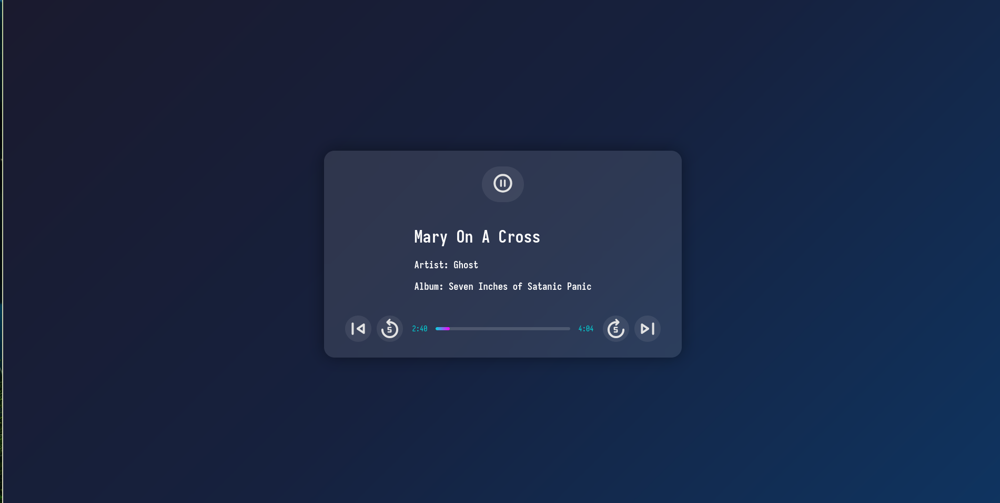

# Controller  
Control your device's media playback locally with ease.



---

### Features  
- Play / Pause control  
- Skip forward/backward by 5 seconds  
- Navigate to previous or next track  
- Supports config file for custom ip and port
---

### Requirements  
- `playerctl`
- `go(lang)` (to build)
- `bun` (to build)

---

### Installation
- After making sure that you have satisfied requirements you can run build.sh to build
- Or build with go build . and run ./Controller

### Infos
- Config file is inside ```($XDG_CONFIG_HOME||$HOME/.config)/Controller/config.json```
- make sure path has the frontend folder
- Navigation: 
- * Space to play/pause
- * Left/Right arrow for previous/next
- * Up/Down arrow to Skip forward 5 seconds/Skip back 5 seconds

## Contributions  
Feel free to open PRs! Suggestions and improvements are always welcome.

go for backend, solidjs for ui